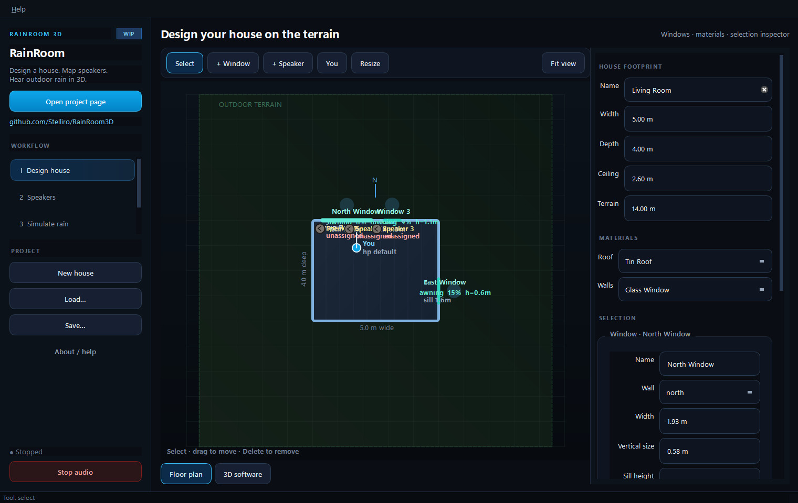
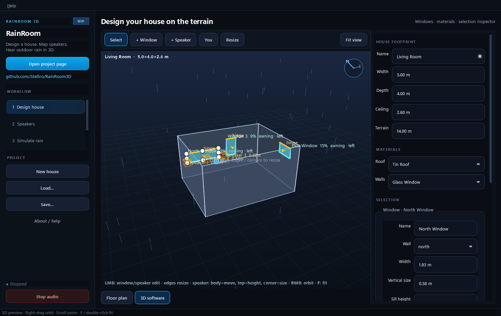
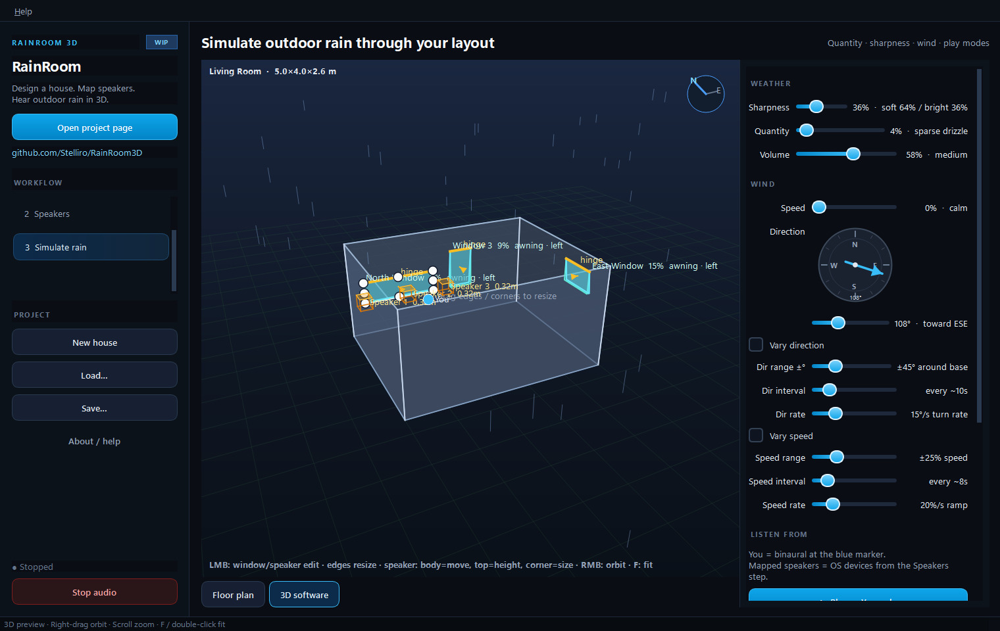
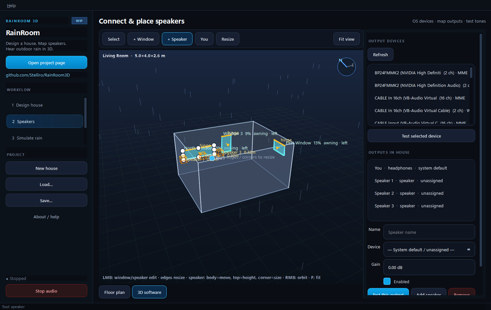

# RainRoom3D

**Design your room on a terrain map, place real speakers, and hear outdoor rain come through your windows in 3D.**

[](LICENSE)
[](#status--work-in-progress)
[](#quick-start)
[](requirements.txt)

| | |
|---|---|
| **Repo** | [github.com/Stelliro/RainRoom3D](https://github.com/Stelliro/RainRoom3D) |
| **Default layout** | [`configs/my_house.json`](configs/my_house.json) (Living Room) |
| **License** | [PolyForm Noncommercial 1.0.0](LICENSE) — **no commercial use** |

> **Work in progress.** Spatial rain, multi-device routing, and the editor are actively evolving. Expect rough edges. Noncommercial use and feedback welcome.

<p align="center">
  
</p>

<p align="center">
  
  &nbsp;
  
</p>

*All images above are **real screenshots** of the running app (not mockups).*

---

## Status — work in progress

RainRoom3D is a personal **Windows** experiment for spatial outdoor rain. It is **not** a finished commercial product.

| Ready enough to try | Still rough |
|---------------------|-------------|
| House / window / speaker editor | Rain timbre (wet vs wash) still tuning |
| Binaural **You** + multi-device speakers | Multi-device depends on your OS devices |
| Quantity · sharpness · volume · wind · **sound mix** | OpenGL vs software 3D varies by GPU |
| Default Living Room layout | No first-class macOS / Linux support |

---

## What it can do

- **Design** a house on outdoor terrain — footprint, materials, windows (open style, sill, hinge)  
- Place **You** (binaural listener) and **speakers**, assign real OS output devices  
- **Simulate** outdoor rain: continuous wash + soft wet impacts, depth layers (near/mid/far/roof/canopy)  
- Rain couples through **open windows** (distance, delay, air absorption)  
- **Sound mix** prefs (wash · droplets · room echo · wind air) — saved with the house  
- **Play as You**, **mapped speakers**, or **You + speakers**  
- Optional rain loop WAVs in [`assets/audio/rain/`](assets/audio/rain/)  

<p align="center">
  
</p>

---

## Quick start

**Requirements:** Windows · Python 3.10+ · sound output

```powershell
git clone https://github.com/Stelliro/RainRoom3D.git
cd RainRoom3D
python -m pip install -r requirements.txt
python -m app.main
```

Or double-click **`run.bat`**.

### First listen

1. App loads **Living Room** by default  
2. Open a window a little in the inspector  
3. Quantity · Volume · Sharpness on **Simulate**; optional balance on **Sound mix**  
4. **Play as You** with headphones  

---

## Workflow

| Step | What you do |
|------|-------------|
| **1 Design** | Size the house, place windows, set materials |
| **2 Speakers** | Refresh devices, map OS outputs, test tones |
| **3 Simulate** | Quantity / sharpness / wind / volume → Play |

Views: **Floor plan** · **3D software** (always works) · **OpenGL 3D** (when available).

---

## Project layout

```text
app/                 UI, models, spatial rain engine
assets/audio/rain/   Optional outdoor rain WAV loops
configs/             my_house.json (default), example_room.json
docs/media/          README screenshots (real captures)
scripts/             Screenshots, packaging, rain sample gen
```

Recapture README images after UI changes:

```powershell
python scripts/capture_screenshots.py
```

---

## Releases

See **[Releases](https://github.com/Stelliro/RainRoom3D/releases)** for **source** and optional **Windows portable** zips.

Local Windows portable build (lean — excludes CUDA / ML packages that may sit in a global Python env):

```powershell
powershell -ExecutionPolicy Bypass -File scripts/build_release.ps1
# → dist/RainRoom3D/RainRoom3D.exe
# → dist/RainRoom3D-windows-portable.zip
```

Source-only zip:

```powershell
powershell -ExecutionPolicy Bypass -File scripts/package_source_zip.ps1
```

---

## License

**[PolyForm Noncommercial License 1.0.0](LICENSE)** — Copyright (c) 2026 Stelliro.

| Allowed | Not allowed |
|---------|-------------|
| Personal use, hobby, study | **Commercial use** |
| Modify & share (keep notices) | Selling or monetizing this / derivatives |
| Research / noncommercial orgs (as defined) | Sublicensing for commercial purposes |

**No one may use this project to make money.** Full text: [LICENSE](LICENSE).

---

## Contributing / feedback

This is a **WIP** personal project. Issues and noncommercial experiments are welcome — please respect the noncommercial license.
