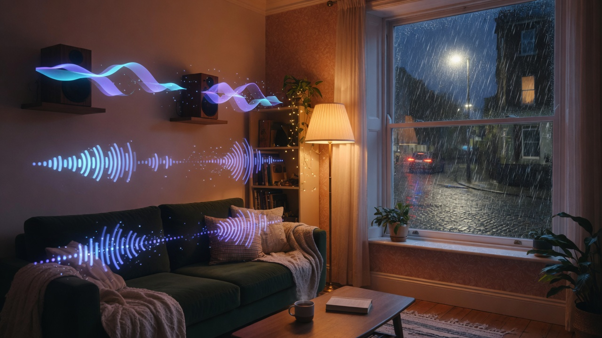
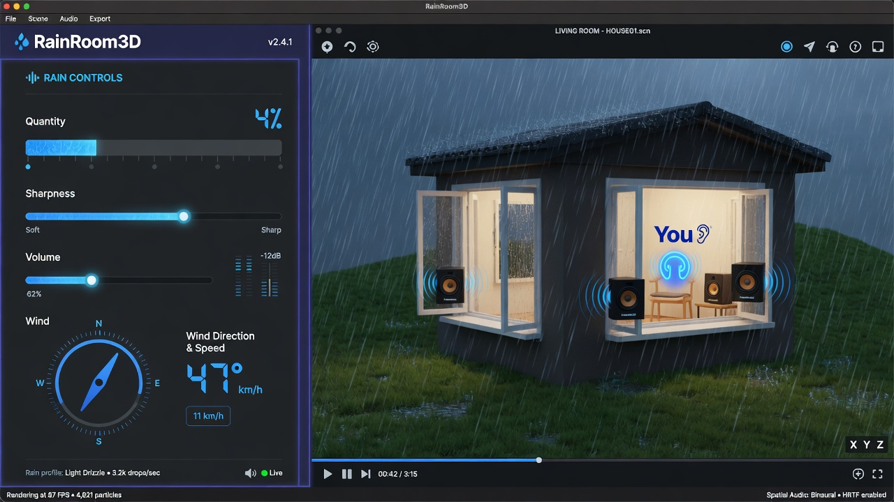
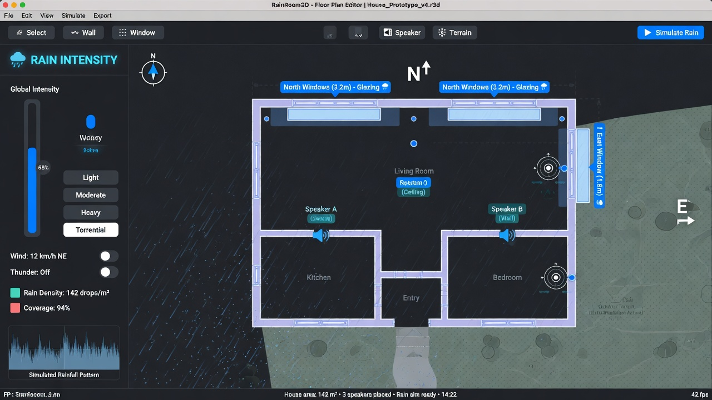

# RainRoom3D

**Design your room on a terrain map, place real speakers, and hear outdoor rain come through your windows in 3D.**

[](LICENSE)
[](#status--work-in-progress)
[](#quick-start)
[](requirements.txt)

| | |
|---|---|
| **Repo** | [github.com/Stelliro/RainRoom3D](https://github.com/Stelliro/RainRoom3D) |
| **Default layout** | [`configs/my_house.json`](configs/my_house.json) (Living Room) |
| **License** | [PolyForm Noncommercial 1.0.0](LICENSE) — **no commercial use** |

> **Work in progress.** Audio, spatial routing, and UI are actively evolving. Expect rough edges, especially around rain timbre and multi-device quirks. Feedback and experiments welcome for **noncommercial** use.

<p align="center">
  
</p>

<p align="center">
  
  &nbsp;
  
</p>

*UI images are illustrative previews for the README; the live app uses the Python/PySide6 editor described below.*

---

## What is this?

RainRoom3D is a **Windows desktop experiment** that couples:

1. A **house + terrain** editor (footprint, windows, open styles, “You” listener, speakers)  
2. A **procedural outdoor rain field** (continuous wash + soft wet impacts)  
3. **Spatial routing** so rain couples indoors through **open windows** (distance, delay, air absorption)  
4. Playback as **binaural headphones** and/or **mapped real speakers** (each speaker ≈ a mic in the room)

It is **not** a finished commercial product, a DAW plugin, or a general game engine. It is a personal spatial-rain playground you can run and tinker with.

### What it can do today

- Load a **Living Room** default (`configs/my_house.json`) with your layout, quantity, sharpness, and volume prefs  
- Edit **room size**, **windows** (open amount, hinge/style), **speakers** (position, size, device, gain)  
- **Play as You** (binaural), **speakers only**, or **You + speakers**  
- Control **quantity** (how many hits), **sharpness**, **master volume**, **wind** (speed / direction / variation)  
- Outdoor **depth layers** (near / mid / far / roof / canopy) + optional rain loop WAVs in `assets/audio/rain/`  
- Soft wet impacts (unpitched) with rare hollow tarp/shell specials  

### Known limits (WIP)

- Rain synthesis is still being tuned (wet vs wash vs brightness)  
- Multi-device routing depends on OS devices and may need manual assignment  
- OpenGL / software 3D views can differ by GPU/driver  
- No macOS/Linux first-class support yet  
- Not production-audio certified; bring headphones and patience  

---

## Quick start

**Requirements:** Windows · Python 3.10+ · working sound output

```powershell
git clone https://github.com/Stelliro/RainRoom3D.git
cd RainRoom3D
python -m pip install -r requirements.txt
python -m app.main
```

Or double-click **`run.bat`**.

### Suggested first listen

1. App loads **Living Room** by default  
2. Open windows a bit in the inspector  
3. Set **Quantity** low (e.g. ~4%), **Volume** mid (~58%), leave **Sharpness** where you like  
4. **Play as You** with headphones  

---

## Workflow

1. **Design house** — footprint on terrain; windows on walls that face the weather  
2. **Place “You”** — blue listener for binaural  
3. **Speakers** — put them where they sit in real life; assign OS output devices; test each  
4. **Simulate** — quantity / sharpness / wind / volume  
5. **Play** — You · Speakers · You + Speakers  

---

## Project layout

```text
app/                 UI, models, spatial rain engine
assets/audio/rain/   Optional outdoor rain WAV loops
configs/             my_house.json (default), example_room.json
docs/                Design notes + README media
scripts/             Rain sample generator, packaging helpers
```

| Doc | |
|-----|---|
| [Audio engine notes](docs/AUDIO_ENGINE_NOTES.md) | Synthesis / spatial design |
| [Weather controls](docs/WEATHER_CONTROLS.md) | Control schema |
| [Rain sample assets](assets/audio/rain/README.md) | Drop real rain WAVs here |

---

## Optional CLI audio

```powershell
python -m app.audio.engine --single-drop --surface water --size-mm 3.5
python -m app.audio.engine --render 120 --seconds 4 --intensity 0.35 --out out/rain.wav
python scripts/gen_rain_samples.py
```

---

## Releases

See **[Releases](https://github.com/Stelliro/RainRoom3D/releases)** for tagged source packages.

A Windows folder build (when present) is built with PyInstaller via:

```powershell
powershell -ExecutionPolicy Bypass -File scripts/build_release.ps1
```

Output lands under `dist/RainRoom3D/` (gitignored). Prefer running from source if the frozen build is missing or outdated.

---

## License

**[PolyForm Noncommercial License 1.0.0](LICENSE)** — Copyright (c) 2026 Stelliro.

| Allowed | Not allowed |
|---------|-------------|
| Personal use, hobby, study | **Commercial use** |
| Modify & share (keep notices) | Selling the software or making money from it / derivatives |
| Research / noncommercial orgs (as defined in the license) | Sublicensing for commercial purposes |

**No one may use this project to make money.** Full text: [LICENSE](LICENSE).

---

## Contributing / feedback

This is a **WIP** personal project. Issues and noncommercial experiments are welcome. Please respect the noncommercial license.
